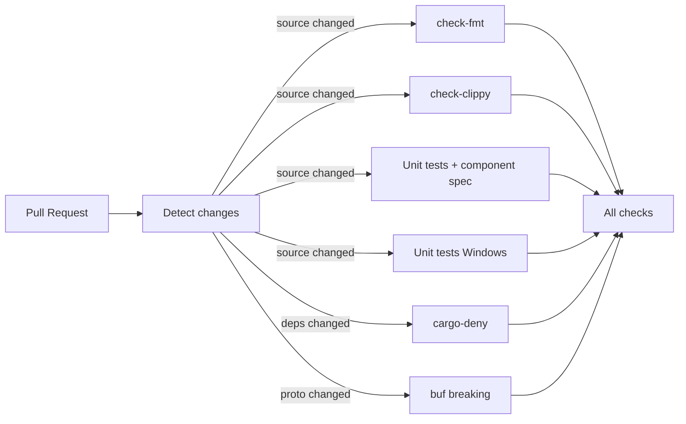
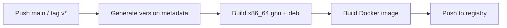

# GitHub Actions — Design Doc

## Context

Sol is a fork of Vector (Datadog) and inherits **42 GitHub Actions workflows** designed for Vector's upstream open-source project. Most of these workflows are unnecessary for Sol's purposes: they serve Datadog-specific infrastructure (SMP regression, Datadog CI, dd-pkg), open-source governance (CLA, gardener bots, scorecards), upstream publishing (S3, DockerHub/timberio, Homebrew), preview sites (Amplify), and platform targets Sol doesn't ship to (Windows MSI, macOS).

Sol needs a lean CI/CD that validates code on PRs and produces deployable artifacts (`.deb` package and Docker image).

## Functional Requirements

### <a id="fr0"></a>FR0 — Rename default branch from `master` to `main`

Rename the default branch to `main`. All workflow triggers, branch references, and documentation must use `main` instead of `master`. The rename is done via GitHub (Settings → Branches → Default branch), which automatically redirects existing PRs and local tracking branches.

### <a id="fr1"></a>FR1 — PR validation checks

On every pull request, run the following checks (all must pass before merge):

| Check | Command | Runner | Condition |
|---|---|---|---|
| Format | `make check-fmt` | ubuntu-24.04 | source changed |
| Clippy | `make check-clippy` | ubuntu-24.04-8core | source changed |
| Unit tests (Linux) | `make test` | ubuntu-24.04-8core | source changed |
| Component spec validation | `make test-component-validation` | (same job as Linux unit tests) | source changed |
| Unit tests (Windows) | `make test` | windows-2025-8core | source changed |
| Security & license audit | `make check-deny` | ubuntu-24.04 | dependencies changed |
| Protobuf compatibility | `buf breaking --against .git#branch=main` | ubuntu-24.04 | proto files changed |

Only run checks when relevant files change. Skip when only docs change.

### <a id="fr2"></a>FR2 — Build DEB package

On push to `main` and on version tags (`v*`), build the `.deb` package for `x86_64-unknown-linux-gnu`. The build uses `cargo vdev package deb` via the existing Makefile target `package-deb-x86_64-unknown-linux-gnu`.

The `.deb` artifact must be uploaded as a GitHub Actions artifact and available for download.

### <a id="fr3"></a>FR3 — Build Docker image

Build a Docker image using the existing `distribution/docker/debian/Dockerfile`, which installs the `.deb` inside a `debian:trixie-slim` base. The image must be built for `linux/amd64` (single platform, matching the deb target).

### <a id="fr4"></a>FR4 — Push Docker image to configurable registry

Push the Docker image to a container registry configured via GitHub secrets:

| Secret | Purpose |
|---|---|
| `DOCKER_REGISTRY` | Registry URL (e.g., `ghcr.io/org`, `registry.example.com`) |
| `DOCKER_USERNAME` | Registry username |
| `DOCKER_PASSWORD` | Registry password/token |

The image must be tagged with:
- The version (extracted from Cargo.toml) on version tags
- `latest` on pushes to `main`
- The git SHA always

### <a id="fr5"></a>FR5 — Nightly upstream compatibility check

Run a scheduled nightly workflow that validates Sol against upstream proto specs:

1. **OTLP protos**: fetch latest `opentelemetry/proto/` from `open-telemetry/opentelemetry-proto` `main` branch, replace vendored copies in `lib/opentelemetry-proto/src/proto/` and `lib/otel-proto-types/src/proto/`, then `cargo check` and `cargo test`.
2. **Vector protos**: fetch latest `proto/vector/` from `vectordotdev/vector` `master` branch, replace vendored copies in `proto/vector/`, then `cargo check` and `cargo test`.

If either step fails (build or tests break), the workflow fails — signaling that upstream has diverged and Sol needs attention. This is an early-warning system, not a gate.

## Non-Functional Requirements

### <a id="nfr1"></a>NFR1 — Minimize CI cost

Use path-based filtering to skip unnecessary work. Use Cargo caching (`actions/cache`) to speed up builds. Target only `x86_64-unknown-linux-gnu` — no cross-compilation, no macOS, no Windows.

### <a id="nfr2"></a>NFR2 — No external service dependencies

The new CI must not depend on Datadog CI, AWS S3, dd-pkg, SMP, Amplify, or any service requiring credentials Sol doesn't own.

### <a id="nfr3"></a>NFR3 — Reuse existing build infrastructure

Leverage the existing `Makefile`, `vdev` tool, `.github/actions/setup` composite action, and `distribution/` packaging scripts. Do not rewrite build tooling.

## Non-goals

- **Multi-architecture builds** — Sol currently targets only x86_64 Linux for packaging. ARM/macOS support may come later.
- **RPM packages** — Only `.deb` is required.
- **Integration tests in CI** — The upstream integration test matrix (35+ services) is too heavy. Integration testing is done locally.
- **Nightly release builds** — No scheduled release/package builds (nightly is for upstream compatibility only).
- **Homebrew publishing** — Not needed.
- **Preview site deployment** — No website infrastructure.
- **CLA/governance automation** — Sol is not an open-source project requiring contributor agreements.
- **Performance regression testing** — No SMP infrastructure.

## Rabbit holes

- **vdev dependency on upstream paths**: The `vdev` tool and Makefile may reference Vector-specific paths or Docker images (`timberio/vector-dev`). Cap investigation to 30 min; if `vdev package deb` works on the runner, use it as-is.
- **Custom runner labels**: Upstream uses `release-builder-linux` runners. Sol uses standard GitHub-hosted runners. Ensure builds complete within the 6-hour GHA timeout on `ubuntu-24.04-8core`.

## Design

### Workflow structure

Replace 42 workflows with **4 files**:

```
.github/workflows/
  ci.yml           <- PR checks (FR1)
  build.yml        <- Build + publish on main/tags (FR2, FR3, FR4)
  nightly.yml      <- Upstream proto compatibility check (FR5)
  changes.yml      <- Reusable path-filter (keep, simplified)
```

### CI flow (ci.yml)



### Build flow (build.yml)



### Custom actions retained

- `.github/actions/setup` — used by all jobs for Rust toolchain, caching, mold linker, protoc, etc.
- `.github/actions/install-vdev` — used by setup action for vdev CLI caching

### Custom actions removed

- `.github/actions/pull-test-runner` — integration test specific, removed
- `.github/actions/spelling/` — upstream spell checking, removed

### Secrets required

| Secret | Used by | Required |
|---|---|---|
| `DOCKER_REGISTRY` | build.yml | Yes |
| `DOCKER_USERNAME` | build.yml | Yes |
| `DOCKER_PASSWORD` | build.yml | Yes |

`GITHUB_TOKEN` is automatic and used for GHCR login if the registry is `ghcr.io`.

## Decisions

- [ADR-0013: Workflow consolidation strategy](../adrs/0013-workflow-consolidation.md)
- [ADR-0014: Single architecture target](../adrs/0014-single-arch-target.md)

## Cross-cutting Concerns

- **Observability**: GitHub Actions provides built-in workflow run logs and timing. No external CI monitoring (Datadog CI) needed.
- **Migration**: Old workflows will be deleted in a single commit. No rollback needed — the old workflows reference infrastructure Sol doesn't have.
- **Security**: Pin all third-party actions to SHA commits (already done upstream). Secrets are scoped to the repository.
