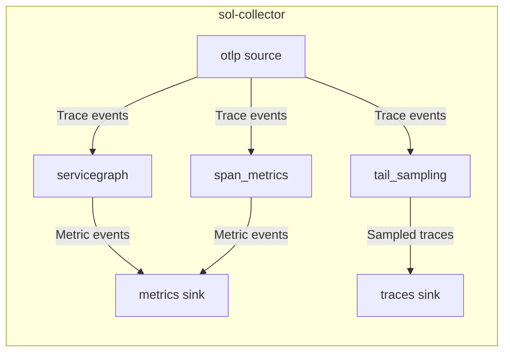

# servicegraph — Design Doc

## Context

The Sol demo pipeline currently provides per-service RED metrics via the `span_metrics` transform but lacks inter-service **edge metrics** — the client-to-server request counts and latencies that power Grafana's service graph panel. The OTel Collector Contrib project provides a [`servicegraphconnector`](https://github.com/open-telemetry/opentelemetry-collector-contrib/tree/main/connector/servicegraphconnector) that fills this role. Sol needs an equivalent `servicegraph` transform that emits compatible metrics.

The load balancer already routes spans by traceID, so all spans of a trace arrive at the same `sol-collector` instance — a prerequisite for span pairing.

**Authority**: OpenTelemetry specifications. **Reference implementation**: otelcontribcol `servicegraphconnector`.

## Functional Requirements

### <a id="fr1"></a>FR1 — Span pairing

Pair CLIENT/PRODUCER spans with SERVER/CONSUMER spans using the parent span ID matching strategy defined in [ADR 0001](../adrs/0001-span-pairing-strategy.md). A client span is stored under key `(trace_id, span_id)`; a server span looks up key `(trace_id, parent_span_id)`. When both sides are present, the edge is complete.

### <a id="fr2"></a>FR2 — Edge metrics

Emit OTel metrics compatible with the otelcontribcol `servicegraphconnector`. On each flush interval, emit the following metrics for every completed edge aggregation:

| Metric name | Type | Description |
|---|---|---|
| `traces_service_graph_request` | Sum (monotonic) | Total requests between two services |
| `traces_service_graph_request_failed` | Sum (monotonic) | Failed requests (any span with status ERROR) |
| `traces_service_graph_request_server` | Histogram | Server-side latency in seconds |
| `traces_service_graph_request_client` | Histogram | Client-side latency in seconds |

OTLP metric names omit Prometheus-specific suffixes (`_total`, `_seconds`). The receiving backend (e.g., Mimir with `-distributor.otel-metric-suffixes-enabled`) adds them during OTLP-to-Prometheus conversion.

Dimensions on every metric: `client`, `server`, `connection_type`, plus user-configured custom dimensions.

### <a id="fr3"></a>FR3 — Connection type detection

Detect the connection type from span attributes:
- If `messaging.system` attribute is present → `connection_type = "messaging_system"`
- If `db.system` attribute is present → `connection_type = "database"`
- Otherwise → `connection_type = ""`

### <a id="fr4"></a>FR4 — Custom dimensions

Allow users to configure additional span or resource attributes to include as metric dimensions. Following the otelcontribcol convention, custom dimension keys are prefixed with `client_` or `server_` depending on which span provided the value.

### <a id="fr5"></a>FR5 — Unpaired span expiration

Spans that do not find their pair within the configured TTL expire. Expired edges increment `sol_servicegraph_unpaired_spans_total`. Expired edges do **not** emit request or latency metrics.

### <a id="fr6"></a>FR6 — Observability

Emit internal Sol metrics for the transform itself (via the `metrics` crate, same pattern as `tail_sampling`):
- `sol_servicegraph_edges_total` (counter) — completed edges
- `sol_servicegraph_unpaired_spans_total` (counter) — expired unpaired spans
- `sol_servicegraph_dropped_spans_total` (counter) — spans dropped due to store overflow

## Non-Functional Requirements

### <a id="nfr1"></a>NFR1 — Bounded memory

The store must have a configurable `max_items` cap (default: 1000). When full, the oldest pending edge is evicted and counted as dropped. Memory usage is proportional to `max_items`, not to traffic volume.

### <a id="nfr2"></a>NFR2 — Configurable TTL

The store TTL is configurable (default: 2s). Spans that arrive after their partner has expired are counted as unpaired. The TTL should be short enough to bound memory but long enough for typical client-server span arrival skew.

## Non-goals

- **Trace pass-through** — the servicegraph transform takes Trace input and emits Metric output, following the same pattern as `span_metrics`. Sol's DAG fanout handles the trace flow separately: `otlp.traces` feeds both `servicegraph` (for edge metrics) and `tail_sampling` (for sampled traces) independently. No pass-through is needed.
- **Virtual nodes** — the otelcontribcol connector can synthesize edges for uninstrumented services (via `peer.service`, `db.name` attributes). Deferred to a follow-up workspace. The `connection_type` detection ([FR3](#fr3)) provides partial coverage.
- **Exponential histogram** — the otelcontribcol connector supports exponential histogram buckets. Sol already uses ExponentialHistogram internally ([ADR 0004](../adrs/0004-exponential-histogram-strategy.md)) but the servicegraph transform will emit explicit-bounds histograms for Prometheus/Grafana compatibility, matching the otelcontribcol default. Exponential histogram support can be added later.

## Rabbit holes

- **Flush timing vs edge completion**: edges complete as soon as both spans arrive, but metrics are flushed on a timer. The otelcontribcol connector aggregates by (client, server, connection_type) key and flushes periodically. We follow the same pattern. Don't over-engineer real-time emission.
- **ExpiringHashMap max_items enforcement**: `ExpiringHashMap` does not have a built-in capacity limit — only TTL-based expiration. We need to add our own eviction logic on top (similar to `tail_sampling`'s `num_traces` cap with `insertion_order: VecDeque`). Cap exploration: if adding eviction to ExpiringHashMap gets complex, use a plain HashMap + BTreeMap for deadlines (the tail_sampling pattern) instead.

## Design

### Architecture (C4 Level 2)



### Data flow

```
1. Incoming span event (Event::Trace)
2. Extract: trace_id, span_id, parent_span_id, kind, service.name, latency, status, connection_type
3. If kind == CLIENT or PRODUCER:
     → store.upsert(key=(trace_id, span_id), client_side=SpanInfo)
4. If kind == SERVER or CONSUMER:
     → store.upsert(key=(trace_id, parent_span_id), server_side=SpanInfo)
5. If edge is complete (both sides present):
     → aggregate into (client, server, connection_type) bucket
     → remove from store
     → increment sol_servicegraph_edges_total
6. On flush timer:
     → emit aggregated metrics as Event::Metric
     → drain aggregation buckets
7. On TTL expiry:
     → increment sol_servicegraph_unpaired_spans_total
     → remove from store
8. On store overflow:
     → evict oldest pending edge
     → increment sol_servicegraph_dropped_spans_total
```

### Decisions

- [Span pairing strategy](../adrs/0001-span-pairing-strategy.md)
- [Store implementation](../adrs/0013-servicegraph-store-implementation.md)

## Cross-cutting Concerns

**Observability**: the transform emits its own `sol_servicegraph_*` metrics via the `metrics` crate (same pattern as `tail_sampling`), visible in the Sol self-monitoring dashboard via the "Service graph" row.

**Migration**: no migration needed — this is a new transform. Users add it to their pipeline config.

**Rollback**: remove the `servicegraph` transform from config. No persistent state.
