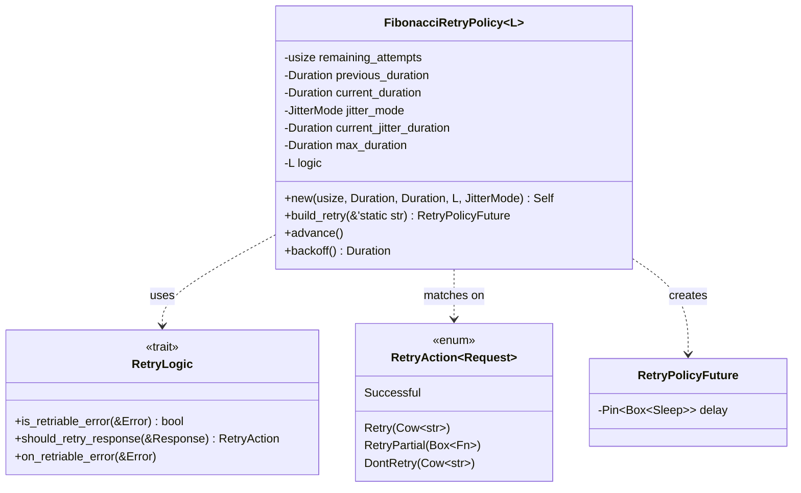

# sink-retry-observability — Tasks

Design: [DESIGN.md](./DESIGN.md)

## Analysis

Build: `cargo check -p sol --lib` — verified green
Test: `cargo test -p sol --lib -- sinks::util::retries` — verified green (5 tests)
Lint: `cargo clippy -p sol-core` fails on pre-existing issues (352 errors in sol-core) — not gated

### Known-failing tests
| Test | Reason | Action |
|---|---|---|
| (none) | | |

### Domain model



### Requirement traceability
| Type / Trait / Fn | Addresses | Notes |
|---|---|---|
| `FibonacciRetryPolicy::build_retry()` | [FR1](./DESIGN.md#fr1), [FR2](./DESIGN.md#fr2), [NFR2](./DESIGN.md#nfr2) | Emits counter + histogram on each retry attempt |
| `FibonacciRetryPolicy::retry()` | [FR1](./DESIGN.md#fr1) | Passes `error_type` to `build_retry()` based on retry scenario |
| `counter!("component_retries_total")` | [FR1](./DESIGN.md#fr1), [NFR1](./DESIGN.md#nfr1) | Lazy registration, only on retry |
| `histogram!("component_retry_backoff_seconds")` | [FR2](./DESIGN.md#fr2), [NFR1](./DESIGN.md#nfr1) | Lazy registration, only on retry |

### Transformations
| Function | Input → Output | Invariant / Rule |
|---|---|---|
| `build_retry(error_type)` | `(&mut self, &'static str) → RetryPolicyFuture` | Must increment counter with error_type label AND record backoff histogram before returning the delay future |
| `retry()` | `(&mut self, &mut Req, &mut Result<Res, Error>) → Option<RetryPolicyFuture>` | Must pass correct error_type: `"response_failed"` for RetryAction::Retry/RetryPartial, `"request_failed"` for retriable errors, `"timeout"` for Elapsed |

### Existing code (from analysis)

**`retries.rs` current `build_retry()`** (line 129):
```rust
fn build_retry(&mut self) -> RetryPolicyFuture {
    self.advance();
    let delay = Box::pin(sleep(self.backoff()));
    debug!(message = "Retrying request.", delay_ms = %self.backoff().as_millis());
    RetryPolicyFuture { delay }
}
```

**`retry()` call sites** (4 total):
- Line 160: `Some(self.build_retry())` — response retry (`RetryAction::Retry`)
- Line 172: `Some(self.build_retry())` — partial response retry (`RetryAction::RetryPartial`)
- Line 191: `Some(self.build_retry())` — retriable error
- Line 203: `Some(self.build_retry())` — timeout (`Elapsed`)

**Existing metric patterns** (from `lib/sol-common/src/internal_event/service.rs`):
```rust
counter!("component_errors_total", "error_type" => error_type::REQUEST_FAILED, "stage" => error_stage::SENDING).increment(1);
```

**Dependencies**: `metrics` crate (0.24.2) — already a dependency of `sol` crate. Only `counter!` and `histogram!` macros needed.

**Test infrastructure**: existing tests in `retries.rs` (lines 247-438) use `tower_test::mock`, `tokio::time`, `tokio_test` macros. `metrics_util::debugging::DebuggingRecorder` available for metric verification (used in `lib/sol-buffers/benches/common.rs`).

## Tasks

### 1. Add retry metrics to `build_retry()` ([FR1](./DESIGN.md#fr1), [FR2](./DESIGN.md#fr2), [NFR1](./DESIGN.md#nfr1), [NFR2](./DESIGN.md#nfr2))
**Goal**: Emit `component_retries_total` counter and `component_retry_backoff_seconds` histogram on each retry attempt.
**Types**: `FibonacciRetryPolicy` — see domain model
**Constraints**:
- `build_retry()` gains an `error_type: &'static str` parameter
- `counter!("component_retries_total", "error_type" => error_type).increment(1)` emitted before creating delay future
- `histogram!("component_retry_backoff_seconds").record(backoff.as_secs_f64())` emitted with the actual backoff duration
- All 4 call sites in `retry()` pass the correct error_type string
- Error types are a fixed set: `"request_failed"`, `"timeout"`, `"response_failed"` — no free-form strings
- Add `use metrics::{counter, histogram};` to imports
- Backoff is computed once (`let backoff = self.backoff();`) to avoid calling it multiple times
**Tests**: write failing tests before implementing
- `test_retry_emits_counter_on_error` — trigger a retriable error, verify `component_retries_total` counter incremented with `error_type = "request_failed"`
- `test_retry_emits_counter_on_timeout` — trigger an Elapsed error, verify counter incremented with `error_type = "timeout"`
- `test_retry_emits_backoff_histogram` — trigger a retry, verify `component_retry_backoff_seconds` histogram recorded
- `test_no_metrics_on_success` — send a successful request, verify no retry metrics emitted
**Verify**: `cargo check -p sol --lib && cargo test -p sol --lib -- sinks::util::retries`
**Acceptance criteria**:
- [ ] `build_retry()` accepts `error_type: &'static str` parameter
- [ ] Counter `component_retries_total` incremented with `error_type` label on every retry
- [ ] Histogram `component_retry_backoff_seconds` records backoff duration on every retry
- [ ] Response retry passes `"response_failed"`, error retry passes `"request_failed"`, timeout retry passes `"timeout"`
- [ ] No metrics emitted on successful requests (NFR1)
- [ ] All existing retry tests pass unchanged (except for `build_retry()` call signature)
**Depends on**: (none)
**Time-box**: ~45 min

### 2. Add "Retry rate" panel to SOL Pipeline dashboard ([FR1](./DESIGN.md#fr1) cross-cutting)
**Goal**: Make retry metrics visible in the Grafana dashboard.
**Constraints**:
- Add a panel to the Sinks row in `demo/otel-sol-grafana-dotnet/grafana/provisioning/dashboards/Sol/SOL Pipeline.json`
- Query: `rate(sol_component_retries_total{service_name=~"$instance"}[$__rate_interval])` by `component_id`
- Panel type: timeseries
- Place it after existing sink panels
**Tests**: manual verification — start demo, stop a downstream service, verify retry rate appears
**Verify**: dashboard JSON is valid (no syntax errors), panel appears in Grafana
**Acceptance criteria**:
- [ ] "Retry rate" panel added to Sinks row
- [ ] Panel queries `sol_component_retries_total` with `$instance` variable filter
- [ ] Panel groups by `component_id`
**Depends on**: task 1
**Time-box**: ~20 min

## Sessions

### Session 1 — Implement retry metrics (~1.5H)
Tasks: 1, 2
**Skills**: `rust-software-engineer`
**Checkpoint**: `cargo check -p sol --lib && cargo test -p sol --lib -- sinks::util::retries`
**Commit point**: yes — commit after checkpoint passes

## Quality gates (post-session review)
- [ ] Acceptance criteria: all green above
- [ ] Code review: implementation matches [DESIGN.md](./DESIGN.md) intent
- [ ] Code organization: changes contained to `retries.rs` and dashboard JSON
- [ ] Code quality: no new complexity, fixed error_type set, no duplication
- [ ] Security review: no secrets, no user input in labels
- [ ] Observability: the whole point — retry metrics now visible
- [ ] Performance: metrics only emitted on retry (NFR1), no hot-path overhead
