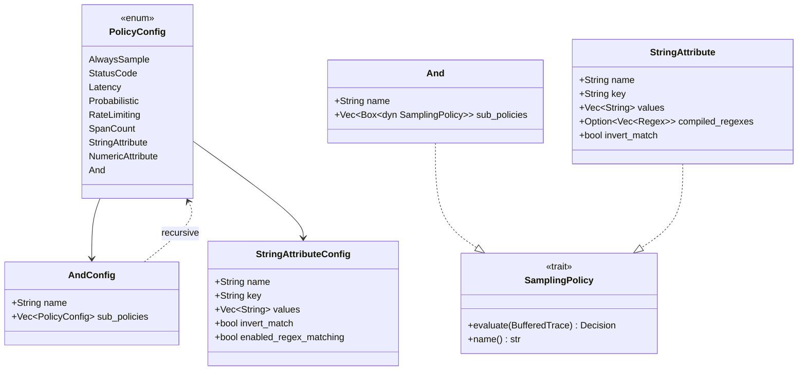

# sol-demo — Tasks

Design: [DESIGN.md](./DESIGN.md)

## Analysis

Build: `cargo build --no-default-features --features api,sources-opentelemetry,sinks-console,sinks-opentelemetry,transforms-remap,transforms-tail_sampling,transforms-span_metrics`
Test: `cargo test -p vector --lib --no-default-features --features api,sources-opentelemetry,sinks-console,sinks-opentelemetry,transforms-remap,transforms-tail_sampling,transforms-span_metrics -- tail_sampling`
Lint: `cargo clippy --no-default-features --features api,sources-opentelemetry,sinks-console,sinks-opentelemetry,transforms-remap,transforms-tail_sampling,transforms-span_metrics`

### Known-failing tests
| Test | Reason | Action |
|---|---|---|
| `span_metrics::tests::custom_dimensions_extracted` | Pre-existing: custom dimensions not found in metric attributes | ignore — unrelated to this work |

### Domain model

### Requirement traceability
| Type / Trait / Fn | Addresses | Notes |
|---|---|---|
| `AndConfig` | [FR1](./DESIGN.md#fr1) | Config for AND composite policy |
| `And` | [FR1](./DESIGN.md#fr1) | Runtime policy: all sub-policies must Sample |
| `StringAttributeConfig` (extended) | [FR2](./DESIGN.md#fr2) | Add invert_match, enabled_regex_matching |
| `StringAttribute` (extended) | [FR2](./DESIGN.md#fr2) | Runtime: regex + invert logic |

### Transformations
| Function | Input → Output | Invariant / Rule |
|---|---|---|
| `And::evaluate` | `&BufferedTrace → Decision` | ALL sub-policies must return Sample; any Drop → Drop; any Pending → Pending |
| `StringAttribute::evaluate` | `&BufferedTrace → Decision` | Match values (exact or regex); if invert_match, swap Sample↔Pending |

### Key files
- `src/transforms/tail_sampling/policies.rs` — PolicyConfig enum, SamplingPolicy trait, all policy implementations
- `src/transforms/tail_sampling/config.rs` — TailSamplingConfig deserialization
- `src/transforms/tail_sampling/transform.rs` — Policy evaluation loop (lines 182-192), tests
- `demo/otel-vector-grafana-dotnet/sol/sol-collector.yaml` — Demo config to update

## Tasks

### 1. AND composite policy ([FR1](./DESIGN.md#fr1))
**Goal**: Allow combining multiple tail sampling policies with AND logic.
**Types**: `AndConfig`, `And` — see domain model
**Constraints**:
- `PolicyConfig` enum uses `#[serde(tag = "type", rename_all = "snake_case")]` — new variant must follow this
- Sub-policies are `Vec<PolicyConfig>` in config, built recursively into `Vec<Box<dyn SamplingPolicy>>`
- Evaluation: ALL sub-policies must return `Sample`. Any `Drop` → `Drop`. Any `Pending` → `Pending`.
**Tests**:
- `test_and_policy_all_match` — AND with (StatusCode ERROR + Latency ≥100ms), trace matches both → Sample
- `test_and_policy_partial_match` — trace matches ERROR but latency <100ms → Pending
- `test_and_policy_empty` — AND with no sub-policies → Pending
- `test_and_policy_single` — AND with one sub-policy behaves like that policy alone
**Verify**: `cargo test -p vector --lib -- tail_sampling`
**Acceptance criteria**:
- [ ] `And(AndConfig)` variant added to `PolicyConfig` enum
- [ ] `And` struct implements `SamplingPolicy` trait
- [ ] All 4 tests pass
- [ ] Existing tail_sampling tests still pass
**Depends on**: (none)
**Time-box**: ~30 min

### 2. StringAttribute invert_match and regex ([FR2](./DESIGN.md#fr2))
**Goal**: Allow string attribute matching to use regex patterns and inverted results.
**Types**: `StringAttributeConfig`, `StringAttribute` — see domain model
**Constraints**:
- When `enabled_regex_matching: true`, compile patterns at `build()` time (fail fast on invalid regex)
- When `invert_match: true`, swap `Sample` ↔ `Pending` in result
- Transformation: `StringAttribute::evaluate` checks regex match when compiled_regexes is Some, else exact match; then applies invert
**Tests**:
- `test_string_attribute_exact_match` — existing behavior preserved
- `test_string_attribute_regex_match` — values: ["4.."], key: "error.type", value "404" → Sample
- `test_string_attribute_invert_match` — invert_match: true, match found → Pending (inverted)
- `test_string_attribute_regex_invert` — regex + invert: values ["4.."], invert_match: true, value "404" → Pending; value "500" → Sample
**Verify**: `cargo test -p vector --lib -- tail_sampling`
**Acceptance criteria**:
- [ ] `invert_match` and `enabled_regex_matching` fields added to `StringAttributeConfig`
- [ ] Regex compilation at build time
- [ ] Invert logic applied after match
- [ ] All 4 tests pass
- [ ] Existing StringAttribute tests still pass
**Depends on**: (none)
**Time-box**: ~30 min

### 3. Update demo config ([FR3](./DESIGN.md#fr3))
**Goal**: Update sol-collector.yaml to use AND policy with string_attribute regex/invert for error filtering.
**Types**: config only
**Constraints**:
- AND policy wraps StatusCode(ERROR) + StringAttribute(error.type, values=["4.."], regex=true, invert=true)
- Update SOL_DEMO.md to remove the AND policy known limitation
**Tests**:
- Manual: `docker compose up --build`, verify traces in Tempo
**Verify**: `cargo check --no-default-features --features api,sources-opentelemetry,sinks-console,sinks-opentelemetry,transforms-remap,transforms-tail_sampling,transforms-span_metrics`
**Acceptance criteria**:
- [x] sol-collector.yaml uses `and` policy for error filtering
- [x] SOL_DEMO.md AND policy limitation removed
- [x] Config compiles (cargo check passes)
**Depends on**: tasks 1, 2
**Time-box**: ~10 min

## Sessions

### Session 1 — Tail sampling policies + demo update (~1H)
Tasks: 1, 2, 3
**Skills**: `rust-software-engineer`, `tdd`
**Checkpoint**: `cargo test -p vector --lib --no-default-features --features api,sources-opentelemetry,sinks-console,sinks-opentelemetry,transforms-remap,transforms-tail_sampling,transforms-span_metrics -- tail_sampling`
**Commit point**: yes

## Quality gates (post-session review)
- [ ] Acceptance criteria: all green above
- [ ] Code review: implementation matches [DESIGN.md](./DESIGN.md) intent
- [ ] Code quality: no new complexity, clean types, no duplication
- [ ] Security review: regex compilation is bounded (no ReDoS from user config)
